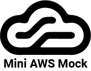
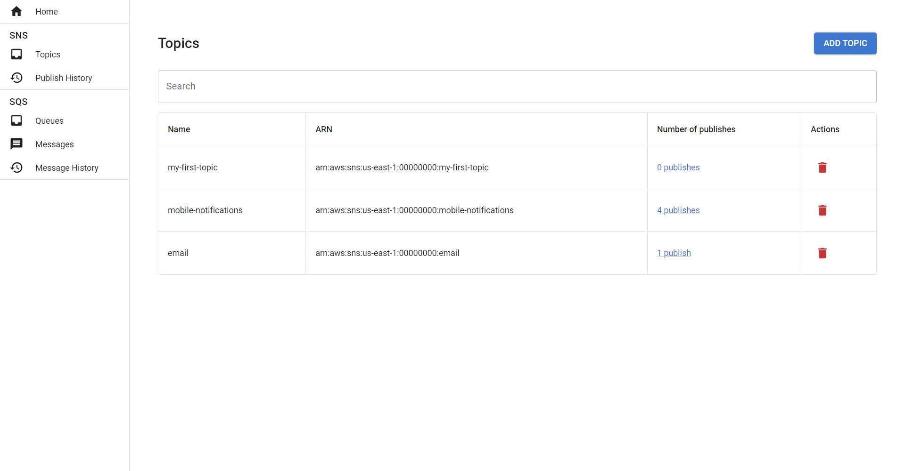

<p align="center">
  
</p>

# Mini AWS Mock



Mini AWS Mock is a simple AWS emulator, designed to run and emulate AWS services locally. It features a Docker image and a user-friendly UI for managing the mock. Currently, it supports a subset of SNS, SQS & KMS services. You can view the [feature coverage here](#feature-coverage).

## Table of Contents

- [Key Features](#key-features)
- [Getting Started](#getting-started)
  - [Prerequisites](#getting-started-prerequisites)
  - [Starting the Mock](#starting-the-mock)
  - [Using AWS CLI with the Mock](#using-aws-cli-with-the-mock)
  - [Accessing the Web Dashboard](#accessing-the-web-dashboard)
- [Docker & Docker Compose](#docker--docker-compose)
  - [Examples](#examples)
  - [Configuration Options](#configuration-options)
  - [Persistence and Initial Data](#persistence-and-initial-data)
  - [Initial Data Files and Schemas](#initial-data-files-and-schemas)
- [Feature Coverage](#feature-coverage)
  - [SNS](#sns)
  - [SQS](#sqs)
  - [KMS](#kms)
- [Local Development](#local-development)
  - [Prerequisites](#local-development-prerequisites)
  - [Setup & Run](#setup--run)
  - [Testing](#testing)
- [Contributing](#contributing)
- [Project Motivation](#project-motivation)
- [Licensing](#licensing)

## Key Features

- :key: Emulates AWS v4 signature process
- :desktop_computer: Includes a user-friendly dashboard for managing the mock with real-time updates
- :whale: Provides Docker images for easy setup and usage

## Getting Started

<h3 id="getting-started-prerequisites">Prerequisites</h3>

- [Docker](https://www.docker.com/)

### Starting the Mock

To start the mock, run the following command:

```bash
docker run \
    -e AWS_REGION=us-east-1 \
    -e AWS_USER_ID='00000000' \
    -e AWS_ACCESS_KEY=mock-access-key \
    -e AWS_SECRET_KEY=mock-secret-key \
    -p 3000:3000 \
    -p 8000:8000 \
    aljazo/mini-aws-mock:latest
```

### Using AWS CLI with the Mock

Ensure you run `aws configure` and set your region, access key, and secret key to match the Docker environment variables.

```bash
# Create an SNS topic
aws --endpoint http://localhost:8000 sns create-topic --name my-first-topic

# Publish a message to an SNS topic
aws --endpoint http://localhost:8000 sns publish --topic-arn "arn:aws:sns:us-east-1:00000000:my-first-topic" --message "My first message for my first topic!"
```

### Accessing the Web Dashboard

- Access the dashboard at [http://localhost:3000](http://localhost:3000).

_Hint: The dashboard updates in real-time when you publish to SNS._

## Docker & Docker Compose

The `aljazo/mini-aws-mock` Docker container is the recommended method for using the mock. Find it on [Docker Hub](https://hub.docker.com/r/aljazo/mini-aws-mock).

### Examples

- Docker:

```bash
docker run \
    -e AWS_REGION=us-east-1 \
    -e AWS_USER_ID='00000000' \
    -e AWS_ACCESS_KEY=mock-access-key \
    -e AWS_SECRET_KEY=mock-secret-key \
    -p 3000:3000 \
    -p 8000:8000 \
    aljazo/mini-aws-mock:latest
```

- Docker Compose:

```yml
services:
  mini-aws-mock:
    image: aljazo/mini-aws-mock:latest
    environment:
      AWS_REGION: us-east-1
      AWS_USER_ID: '00000000'
      AWS_ACCESS_KEY: mock-access-key
      AWS_SECRET_KEY: mock-secret-key
    ports:
      - '3000:3000'
      - '8000:8000'
```

### Configuration Options

Configure the container using the following environment variables:

- `LOG_LEVEL`: Sets the mock's log level (either `debug` or `info`, defaults to `info`)
- `LIST_RESPONSE_SIZE`: Sets the list response size for AWS actions that return a list of records (defaults to `undefined`, returning all records)
- `AWS_REGION`: Mock region
- `AWS_USER_ID`: Mock user ID used for requests
- `AWS_ACCESS_KEY`: Mock access key for v4 signature emulation
- `AWS_SECRET_KEY`: Mock secret key for v4 signature emulation

### Persistence and Initial Data

Persist data between restarts by binding a local folder to `/app/packages/api/data` in Docker:

```yml
services:
  mini-aws-mock:
    image: aljazo/mini-aws-mock:latest
    environment:
      AWS_REGION: us-east-1
      AWS_USER_ID: '00000000'
      AWS_ACCESS_KEY: mock-access-key
      AWS_SECRET_KEY: mock-secret-key
    volumes:
      - ./my-local-data:/app/packages/api/data:rw
    ports:
      - '3000:3000'
      - '8000:8000'
```

Bind a local folder with JSON files for initial database setup. Learn more about file names and schemas [here](#initial-data-files-and-schemas).

```yml
services:
  mini-aws-mock:
    image: aljazo/mini-aws-mock:latest
    environment:
      AWS_REGION: us-east-1
      AWS_USER_ID: '00000000'
      AWS_ACCESS_KEY: mock-access-key
      AWS_SECRET_KEY: mock-secret-key
    volumes:
      - ./my-local-init-data:/app/packages/api/initial-data:ro
    ports:
      - '3000:3000'
      - '8000:8000'
```

_Note: Both persistence and initial data volumes can be mounted. Initial data is processed only when the table is empty._

### Initial Data Files and Schemas

Example `sns-topic.json`:

```json
[
  {
    "name": "my-topic",
    "arn": "arn:aws:sns:us-east-1:00000000:my-topic"
  },
  {
    "name": "another-topic",
    "arn": "arn:aws:sns:us-east-1:00000000:another-topic"
  }
]
```

Example `sqs-queue.json`:

```json
[
  {
    "name": "my-queue",
    "arn": "arn:aws:sqs:us-east-1:00000000:my-queue",
    "url": "http://sqs.us-east-1.localhost:8000/00000000/my-queue",
    "visibilityTimeout": 30,
    "receiveMessageWaitTimeSeconds": 0,
    "maximumMessageSize": 262144
  }
]
```

Example `kms-key.json`:

```json
[
  {
    "id": "a1c6858d-a353-465a-93b8-6dbfa2530e1a",
    "arn": "arn:aws:kms:us-east-1:00000000:key/a1c6858d-a353-465a-93b8-6dbfa2530e1a",
    "alias": "customer-address-encryption-key",
    "encryptionKey": "36d652ccb5f8c2740182576f47f477f127d40c87865fc52e1d41dfa6684dc690",
    "enabled": true,
    "multiRegion": false,
    "origin": "AWS_KMS",
    "keySpec": "SYMMETRIC_DEFAULT",
    "keyUsage": "ENCRYPT_DECRYPT"
  }
]
```

## Feature Coverage

### SNS

| Operation                                                                      | Mock Support       | Dashboard Support  | Comment                                                            |
| ------------------------------------------------------------------------------ | ------------------ | ------------------ | ------------------------------------------------------------------ |
| [CreateTopic](https://docs.aws.amazon.com/sns/latest/api/API_CreateTopic.html) | :white_check_mark: | :white_check_mark: | UI for adding a new topic.                                         |
| [DeleteTopic](https://docs.aws.amazon.com/sns/latest/api/API_DeleteTopic.html) | :white_check_mark: | :white_check_mark: | UI for deleting a topic.                                           |
| [ListTopics](https://docs.aws.amazon.com/sns/latest/api/API_ListTopics.html)   | :white_check_mark: | :white_check_mark: | UI that display list of all topics.                                |
| [Publish](https://docs.aws.amazon.com/sns/latest/api/API_Publish.html)         | :yellow_square:    | :yellow_square:    | UI for viewing publish history and purging it. Logs received data. |

### SQS

| Operation                                                                                                       | Mock Support       | Dashboard Support  | Comment                                                                |
| --------------------------------------------------------------------------------------------------------------- | ------------------ | ------------------ | ---------------------------------------------------------------------- |
| [CreateQueue](https://docs.aws.amazon.com/AWSSimpleQueueService/latest/APIReference/API_CreateQueue.html)       | :white_check_mark: | :white_check_mark: | UI for adding new queue.                                               |
| [DeleteQueue](https://docs.aws.amazon.com/AWSSimpleQueueService/latest/APIReference/API_DeleteQueue.html)       | :white_check_mark: | :white_check_mark: | UI for deleting a queue.                                               |
| [GetQueueUrl](https://docs.aws.amazon.com/AWSSimpleQueueService/latest/APIReference/API_GetQueueUrl.html)       | :white_check_mark: | :white_check_mark: | Shows queue url in queue list.                                         |
| [ListQueues](https://docs.aws.amazon.com/AWSSimpleQueueService/latest/APIReference/API_ListQueues.html)         | :white_check_mark: | :white_check_mark: | UI that displays list of all queues. Also has option to purge a queue. |
| [SendMessage](https://docs.aws.amazon.com/AWSSimpleQueueService/latest/APIReference/API_SendMessage.html)       | :white_check_mark: | :white_check_mark: | Can also sends message from queue list in UI.                          |
| [ReceiveMessage](https://docs.aws.amazon.com/AWSSimpleQueueService/latest/APIReference/API_ReceiveMessage.html) | :white_check_mark: | :white_check_mark: |                                                                        |
| [DeleteMessage](https://docs.aws.amazon.com/AWSSimpleQueueService/latest/APIReference/API_DeleteMessage.html)   | :white_check_mark: | :white_check_mark: | UI that displays list of all deleted messages (message history).       |

### KMS

At present, the AWS KMS functionality is partially supported, specifically for symmetric encryption and decryption. The dashboard UI allows users to view key usage history, as well as create and delete KMS keys.

| Operation                                                                       | Mock Support       | Dashboard Support  | Comment                                      |
| ------------------------------------------------------------------------------- | ------------------ | ------------------ | -------------------------------------------- |
| [Encrypt](https://docs.aws.amazon.com/kms/latest/APIReference/API_Encrypt.html) | :white_check_mark: | :white_check_mark: | Encryption is also supported through the UI. |
| [Decrypt](https://docs.aws.amazon.com/kms/latest/APIReference/API_Decrypt.html) | :white_check_mark: | :white_check_mark: | Decryption is also supported through the UI. |

## Local Development

<h3 id="local-development-prerequisites">Prerequisites</h3>

- [Node v18.17.1](https://nodejs.org/download/release/v18.17.1/)
- [Pnpm v8.15.4](https://pnpm.io/installation#using-npm)

### Setup & Run

1. Create an .env file in the `/packages/api` folder (refer to [.env.example](./packages/api/.env.example) for values).

2. Install dependencies:

```bash
pnpm install
```

3. Start the mock in development mode:

```bash
pnpm run dev
```

You are now ready to develop the mock.

### Testing

- Run both unit and e2e tests:

```bash
# Unit
pnpm --filter @mini-aws-mock/api run test:unit

# E2E
pnpm --filter @mini-aws-mock/api run test:e2e
```

- Generate test coverage:

```bash
pnpm --filter @mini-aws-mock/api run test:cov
```

## Contributing

Your contributions are welcome! Please refer to the [contributing guide](./CONTRIBUTING.md) for more information.

## Project Motivation

Mini AWS Mock began as a personal endeavor; I was in search of a straightforward AWS SNS mock that didn't just do the job, but came with a simple UI for easy management. More than that, I wanted a mock that emulates the AWS v4 signature process. This project is the result of my curiosity about the inner workings of AWS, and it's designed to provide a simple, easy-to-use mock for anyone tackling similar projects or eager to explore AWS's complexities.

## License

This project is licensed under the MIT License. See the [license file](./LICENSE.md) for details.
